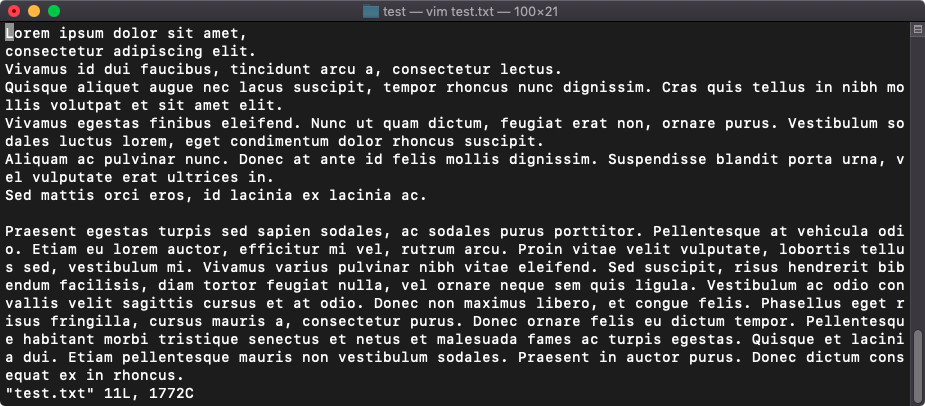

# 从零开始

作为例子，当前文件夹下有两个文件 `test.txt` 和 `test2.txt`。

其中，文件 `test.txt` 中含有文本

```
Lorem ipsum dolor sit amet,
consectetur adipiscing elit.
Vivamus id dui faucibus, tincidunt arcu a, consectetur lectus.
Quisque aliquet augue nec lacus suscipit, tempor rhoncus nunc dignissim. Cras quis tellus in nibh mollis volutpat et sit amet elit.
Vivamus egestas finibus eleifend. Nunc ut quam dictum, feugiat erat non, ornare purus. Vestibulum sodales luctus lorem, eget condimentum dolor rhoncus suscipit.
Aliquam ac pulvinar nunc. Donec at ante id felis mollis dignissim. Suspendisse blandit porta urna, vel vulputate erat ultrices in.
Sed mattis orci eros, id lacinia ex lacinia ac.

Praesent egestas turpis sed sapien sodales, ac sodales purus porttitor. Pellentesque at vehicula odio. Etiam eu lorem auctor, efficitur mi vel, rutrum arcu. Proin vitae velit vulputate, lobortis tellus sed, vestibulum mi. Vivamus varius pulvinar nibh vitae eleifend. Sed suscipit, risus hendrerit bibendum facilisis, diam tortor feugiat nulla, vel ornare neque sem quis ligula. Vestibulum ac odio convallis velit sagittis cursus et at odio. Donec non maximus libero, et congue felis. Phasellus eget risus fringilla, cursus mauris a, consectetur purus. Donec ornare felis eu dictum tempor. Pellentesque habitant morbi tristique senectus et netus et malesuada fames ac turpis egestas. Quisque et lacinia dui. Etiam pellentesque mauris non vestibulum sodales. Praesent in auctor purus. Donec dictum consequat ex in rhoncus.

Nunc non convallis nunc. Donec scelerisque, tortor nec scelerisque ultricies, lorem augue efficitur purus, ac blandit nunc nibh quis neque. Sed vitae luctus leo. Fusce ultrices aliquet sodales. Aenean ut aliquet est, ut consectetur quam. Suspendisse potenti. Pellentesque sed egestas turpis. Aenean aliquam dolor in egestas dictum. Nunc et tincidunt neque.

```

## 打开文件

我们以打开 `test.txt` 为例。

```shell
$ vim test.txt
```



此时已经进入 Vim 的 [正常模式]()

