# 正常模式

打开文件 `test.txt` 后，界面如图

在正常模式 (Normal Mode) 下（通常也叫命令模式 (Command Mode)），依次按照以下表格中的按键得出的结果如右图所示（为方便演示，命令行窗口将缩小展示），最左侧的演示步骤是指右图的结果是从上一步骤经此操作得出。

## 光标的移动

| 按键 | 说明 | 从 | 到
| :---: | :---: | :---: | :---: |
| <kbd>j</kbd> / <kbd>⬇</kbd> | 向下移动光标 | 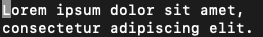 | 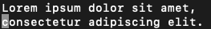 |
| <kbd>l</kbd> / <kbd>➡</kbd> | 向右移动光标 |  | 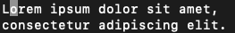 |
| <kbd>k</kbd> / <kbd>⬆</kbd> | 向上移动光标 |  |  |
| <kbd>h</kbd> / <kbd>⬅</kbd> | 向左移动光标 |  |  |
| <kbd>8</kbd><kbd>l</kbd> / <kbd>8</kbd><kbd>➡</kbd> | 命令前加数字可代表命令操作次数，此处代表向右移动光标 8 次 |  | 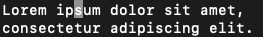 |
| <kbd>W</kbd> / <kbd>w</kbd> | 移动到下一个单词头 |  | 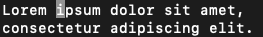 |
| <kbd>B</kbd> / <kbd>b</kbd> | 移动到上一个单词头 | 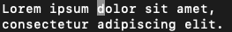 或  |  |
| <kbd>E</kbd> / <kbd>e</kbd> | 移动到下一个单词尾 |  或 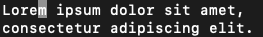 | 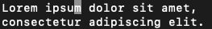 |
| <kbd>g</kbd><kbd>e</kbd> | 移动到上一个单词尾 |  或  |  |
| <kbd>Home</kbd> / <kbd>0</kbd> | 移动到行首 | 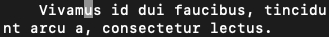 | 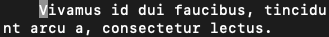 |
| <kbd>End</kbd> / <kbd>$</kbd> | 移动到行尾 |  | 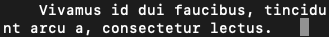 |
| <kbd>^</kbd> | 移动到本行第一个不是空白字符的位置 |  |  |
| <kbd>g</kbd><kbd>_</kbd> | 移动到本行最后一个不是空白字符的位置 |  | 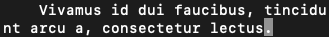 |

